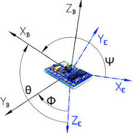
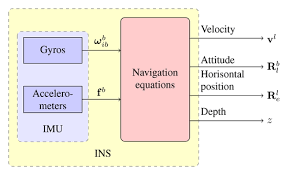
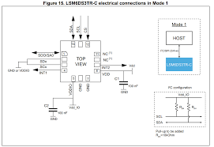
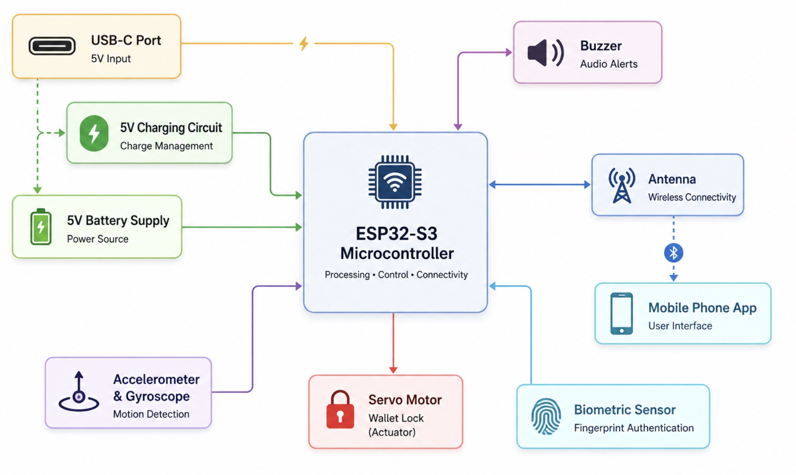

# ECE 196: IMU-Based Theft Detection System using ESP32 (Mini Project #3)

### By: Aiden Krueger

## Abstract

This tutorial demonstrates how to interface an Inertial Measurement Unit (IMU) with an ESP32 to create a motion-based theft detection system. The implementation combines accelerometer and gyroscope measurements to detect suspicious wallet movement and trigger security events. This project introduces embedded sensor interfacing, I²C communication, real-time sensor processing, and motion analysis algorithms.

---


## Course Concepts

This project applies concepts from ECE 35 (Introduction to Analog Design)
and Physics 2A involving vectors and motion analysis.

The accelerometer measures acceleration along three orthogonal axes.

To determine overall motion, the vector magnitude is calculated using:

Acceleration Magnitude = √(ax² + ay² + az²)

This equation comes directly from the Euclidean distance formula and
the Pythagorean Theorem in three dimensions.

Similarly, gyroscope measurements are combined using vector magnitude
calculations to determine total angular velocity.


An Inertial Measurement Unit (IMU) is an electronic sensor that measures motion and orientation using a combination of accelerometers and gyroscopes.

A 6-DoF IMU contains:

* A **3-axis accelerometer**

  * Measures linear acceleration along the X, Y, and Z axes
  * Detects movement, impacts, and tilt

* A **3-axis gyroscope**

  * Measures rotational velocity around the X, Y, and Z axes
  * Detects spinning, turning, and orientation changes

Together, these sensors provide a complete picture of how an object moves in space.





## Accelerometer

The accelerometer measures forces acting on the device.

When stationary:

* X ≈ 0g
* Y ≈ 0g
* Z ≈ 1g (gravity)

The total acceleration magnitude is calculated using:

```text
Acceleration Magnitude = √(ax² + ay² + az²)
```

This combines all three acceleration axes into a single value representing overall motion.

## Gyroscope

The gyroscope measures angular velocity.

Examples:

* Rotating quickly → High gyroscope readings
* Sitting still → Near zero gyroscope readings

The total rotational velocity is calculated using:

```text
Angular Velocity Magnitude = √(gx² + gy² + gz²)
```

Where:

* gx = X-axis rotational speed
* gy = Y-axis rotational speed
* gz = Z-axis rotational speed

## Theft Detection Logic

Simply moving a wallet slightly should not trigger an alarm.

To reduce false positives, the SmartWallet system requires:

1. A sudden acceleration event (jerk)
2. A high rotational velocity event

Both conditions must occur simultaneously before the wallet is considered stolen.

This creates a unique motion signature associated with someone quickly grabbing and moving the wallet.

---

# Step 1: Hardware Setup

## Components Required

* ESP32-S3 Development Board
* LSM6DSOX IMU Sensor
* Breadboard
* Jumper Wires
* USB-C Cable

## Wiring

| IMU Pin | ESP32 Pin |
| ------- | --------- |
| VCC     | 3.3V      |
| GND     | GND       |
| SDA     | GPIO XX   |
| SCL     | GPIO XX   |

Replace the GPIO numbers with the pins used in your project.



---

# Step 2: Arduino IDE Setup

## Install ESP32 Board Support

Follow the setup procedure from Mini Project #2 to install the ESP32 board package in Arduino IDE.

## Required Libraries

Install:

* Wire
* ESP32 Arduino Core

The Wire library provides I²C communication between the ESP32 and the IMU.

---

# Step 3: Initializing the IMU

The ESP32 communicates with the IMU using the I²C protocol.

First, initialize the I²C bus:

```cpp
Wire.begin(IMU_SDA, IMU_SCL, 400000);
```

Next, enable both the accelerometer and gyroscope:

```cpp
writeIMURegister(REG_CTRL1_XL, 0x40);
writeIMURegister(REG_CTRL2_G, 0x40);
```

These settings configure:

### Accelerometer

* 104 Hz Output Data Rate
* ±4g Measurement Range

### Gyroscope

* 104 Hz Output Data Rate
* ±500 Degrees/Second Measurement Range


---

# Step 4: Reading Sensor Data

The IMU stores measurements inside internal registers.

The ESP32 performs a single I²C transaction to retrieve:

* Gyroscope X
* Gyroscope Y
* Gyroscope Z
* Accelerometer X
* Accelerometer Y
* Accelerometer Z

```cpp
Wire.requestFrom(IMU_I2C_ADDR, 12);
```

Each sensor reading is stored as a 16-bit signed integer.

```cpp
int16_t rawGyroX = Wire.read() | (Wire.read() << 8);
```

This process is repeated for all six axes.

---

# Step 5: Converting Raw Sensor Data

Raw sensor values must be converted into physical units before they can be analyzed.

## Accelerometer Conversion

```cpp
float ax = rawAccX * 0.122 / 1000.0;
float ay = rawAccY * 0.122 / 1000.0;
float az = rawAccZ * 0.122 / 1000.0;
```

Output units:

* G-force (g)

## Gyroscope Conversion

```cpp
float gx = (rawGyroX * 17.50) / 1000.0;
float gy = (rawGyroY * 17.50) / 1000.0;
float gz = (rawGyroZ * 17.50) / 1000.0;
```

Output units:

* Degrees per second (dps)

---

# Step 6: Motion Analysis

To evaluate movement, the system calculates total acceleration magnitude:

```cpp
float currentLinearMag =
sqrt(ax*ax + ay*ay + az*az);
```

To determine whether a sudden motion occurred, the change in acceleration between samples is computed:

```cpp
float deltaJerk =
abs(currentLinearMag - lastLinearMag);
```

Jerk measures how quickly acceleration changes and is useful for detecting abrupt movement.

The system also calculates total rotational velocity:

```cpp
float totalRotationVelocity =
sqrt(gx*gx + gy*gy + gz*gz);
```

This value indicates how quickly the wallet is rotating.

---

# Step 7: Theft Detection Algorithm

The SmartWallet uses two motion thresholds:

```cpp
const float ACCEL_JERK_THRESHOLD = 0.75;
const float GYRO_ROTATION_THRESHOLD = 180.0;
```

A theft event is triggered only when both thresholds are exceeded.

```cpp
if (deltaJerk > ACCEL_JERK_THRESHOLD &&
    totalRotationVelocity > GYRO_ROTATION_THRESHOLD)
{
    // Theft detected
}
```

Requiring both conditions helps eliminate false positives caused by:

* Small bumps
* Vibrations
* Normal handling
* Nearby movement
---

# Motion Calibration

Every environment is different, so threshold tuning may be required.

| Motion Type       | Jerk (G)  | Rotation (dps) |
| ----------------- | --------- | -------------- |
| Stationary        | < 0.1     | < 20           |
| Walking Nearby    | 0.1 - 0.4 | 20 - 100       |
| Picking Up Wallet | 0.4 - 0.8 | 80 - 180       |
| Fast Grab / Theft | > 0.75    | > 180          |

Adjust thresholds to balance sensitivity and false alarms.


---

# Step 8: Testing the System

1. Upload the code to the ESP32.
2. Open Serial Monitor at 115200 baud.
3. Leave the wallet stationary and observe baseline readings.
4. Pick up the wallet slowly and verify that no theft alert occurs.
5. Quickly grab and rotate the wallet.
6. Verify that a theft alert message appears in the Serial Monitor.
7. Adjust thresholds if necessary.

---

# Final Project Integration

The IMU subsystem serves as the primary theft-detection sensor in the SmartWallet project.

When abnormal motion is detected:

1. Accelerometer detects sudden movement
2. Gyroscope confirms rapid rotation
3. Theft detection algorithm validates both conditions
4. ESP32 raises a theft event
5. BLE alert flag is set
6. Mobile application receives notification
7. User is alerted that the wallet may have been moved



The IMU subsystem works together with the BLE communication system to provide real-time theft monitoring and notification capabilities for the SmartWallet.

---

# Additional Resources

* https://www.st.com/

  * Official documentation and datasheets for the LSM6DSOX IMU

* https://docs.arduino.cc/

  * Arduino programming references and I²C communication examples

* https://randomnerdtutorials.com/

  * ESP32 and sensor interfacing tutorials

* Final Project Website:

  * https://akrew10.github.io/ECE196_Fingerprint_Wallet/
 


# AI Use Disclosure

ChatGPT was used to assist with editing the writing,
improving grammar, organizing the tutorial structure,
and generating example diagrams for the motion detection
flowchart. All project implementation details, code,
testing, and technical content were developed and
verified by the author.
